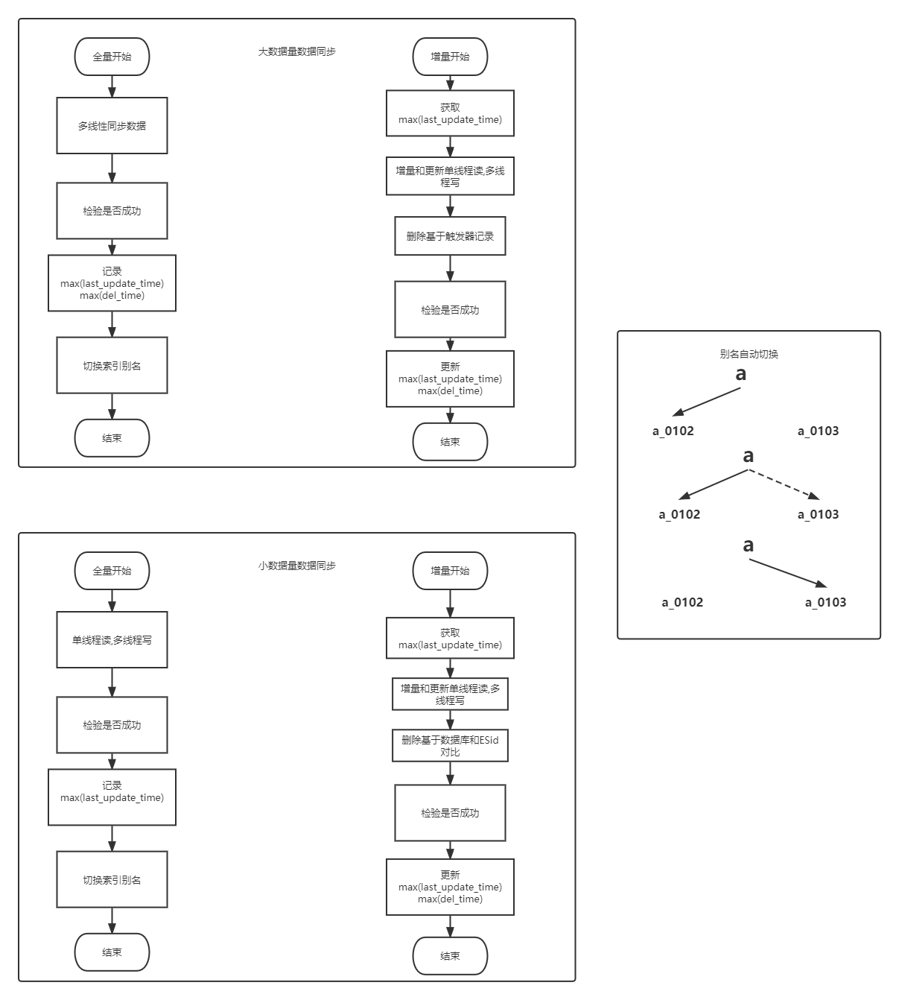

## db2es:1.0
数据库同步ES的Swagger版

## 优点
* 相比于logstash,支持对数据的真删除进行同步(基于触发器)
* 对大数据量同步性能更出色,基于id或自增列进行多线程分批同步
* 完全又java语言进行开发,数据清洗给为简单
* 支持定时任务进行索引的增量同步
* 支持同步完毕的邮件和钉钉通知
* 同步基于sql,支持mysql,sqlserver等关系型数据库

## 接口展示

## 运行条件
* 修改yml的mysql连接信息并在mysql创建数据库index_sync,执行src/main/resources/init-sql/mysql_create.sql
  * index_cycle_info表 存储同步时间信息,以便查询增量数据
  * task_job表 存储定时器任务信息
  * task_record表 存储全量和增量索引任务状态信息
* 修改yml的Sqlserver连接信息并在sqlserver执行sqlserver_create.sql
  * trigger_deleted表 记录删除数据的信息
  * trigger_big_data_delete触发器 记录表big_data的删除操作到trigger_deleted表
* 修改es连接信息 
* 运行项目启动类即可

## 访问地址
* dev
  * db2es地址:http://localhost:8888/doc.html

## 主要流程图

## 技术架构
springboot2 maven mybatis-plus mysql sqlserver logback es swagger

## 联系我
Fan.Wang@bjtu.edu.cn

